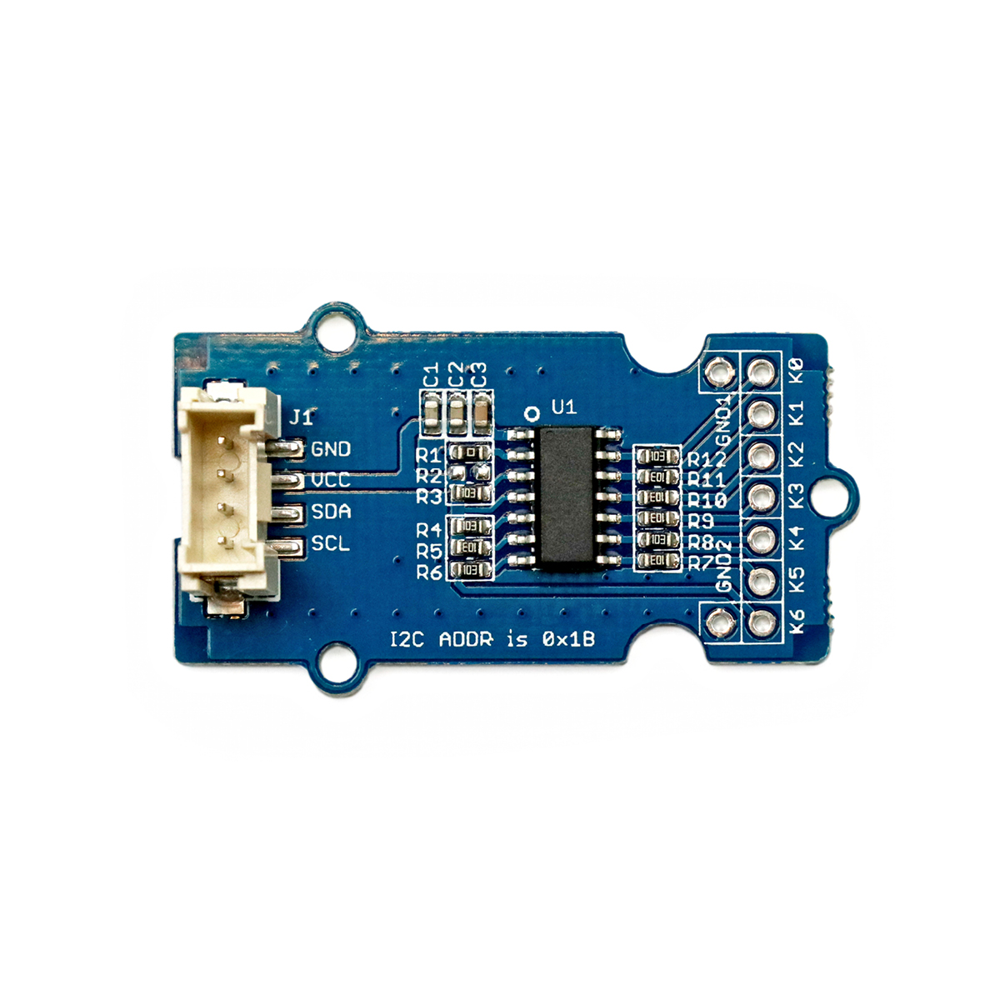

---
title: "Berührungssensor"
date: "2018-10-02T07:02:32.000Z"
tags: 
  - "sensor"
coverImage: "57_beruehrungssensor_qtouch.jpg"
material_number: "57"
material_type: "sensor"
material_short_descr: "Seeed Studio Grove – QTouch Sensor"
manufacture: "Seeed Studio"
manufacture_url: "https://www.seeedstudio.com/"
repo_name: "mks-SeeedStudio-Grove_Q_Touch_Sensor"
repo_prefix: "mks"
repo_manufacture: "SeeedStudio"
repo_part: "Grove_Q_Touch_Sensor"
product_url: "http://wiki.seeedstudio.com/Grove-Q_Touch_Sensor/"
clone_url: "https://github.com/Make-Your-School/mks-SeeedStudio-Grove_Q_Touch_Sensor.git"
embedded_example_file: "examples/Grove_Q_Touch_Sensor_minimal/Grove_Q_Touch_Sensor_minimal.ino"
---

# Berührungssensor

## Beschreibung
Der Berührungssensor QTouch erkennt, sobald ein an den Sensor angeschlossener Gegenstand berührt wird. So lässt sich beispielsweise eine Banane mit dem Sensor verbinden. Sobald die Banane berührt wird, übermittelt dies der Sensor an den Mikrocontroller. Es können gleichzeitig bis zu sieben Berührungsobjekte an das Modul angeschlossen werden. Der Berührungssensor lässt sich direkt oder mithilfe des Grove Shields an einen Arduino oder Raspberry Pi über \[simple\_tooltip content='Bei einer seriellen Datenübertragung werden die Bits (Informationen / Kommandos) nacheinander (seriell) über eine Leitung übertragen. Die wichtigsten seriellen Standards im Rahmen der Microcontroller sind I2C (Inter-Integrated Circuit), SPI (Serial Peripheral Interface) und UART (Universal Asynchronous Receiver Transmitter). Die genaue Funktionsweise ist für die reine Nutzung vorerst irrelevant. Es muss allerdings immer geprüft werden an welchen Pins oder an welchen Steckplätzen der jeweilige serielle Anschluss genutzt werden kann. Dies wird in den Datenblättern der Mikrocontroller normalerweise immer mit angegeben.'\]die serielle Schnittstelle I2C \[/simple\_tooltip\]angeschlossen.

Das Modul kommt beispielsweise beim Bau einer Leuchte zum Einsatz, die durch Berührung des Gehäuses an- oder ausgeschaltet wird.

Alle weiteren Hintergrundinformationen sowie ein Beispielaufbau und alle notwendigen Programmbibliotheken sind auf dem offiziellen Wiki (bisher nur in englischer Sprache) von Seeed Studio zusammengefasst. Zusätzlich findet man über alle gängigen Suchmaschinen meist nur mit der Eingabe der genauen Komponenten-Bezeichnungen entsprechende Projektbeispiele und Tutorials.

 

<!-- infolist -->
## Wichtige Links für die ersten Schritte:

- [Seeed Studio Wiki](http://wiki.seeedstudio.com/Grove-Q_Touch_Sensor/) [- QTouch Berührungssensor](http://wiki.seeedstudio.com/Grove-Q_Touch_Sensor/)

## Weiterführende Hintergrundinformationen:

- [I2C - Wikipedia Artikel](https://de.wikipedia.org/wiki/I%C2%B2C)
- [SPI - Wikipedia Artikel](https://de.wikipedia.org/wiki/Serial_Peripheral_Interface)
- [UART - Wikipedia Artikel](https://de.wikipedia.org/wiki/Universal_Asynchronous_Receiver_Transmitter)
- [GitHub-Repository: Berührungssensor QTouch](https://github.com/MakeYourSchool/57-Beruehrungssensor-QTouch)

